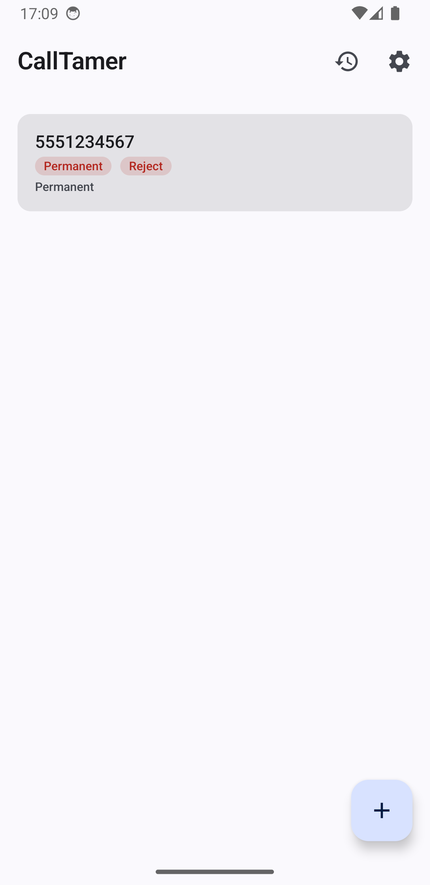
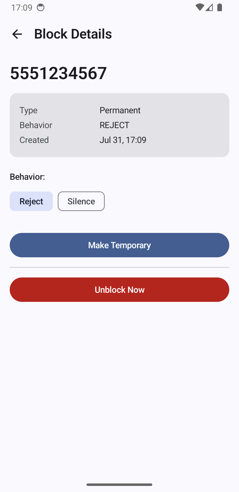
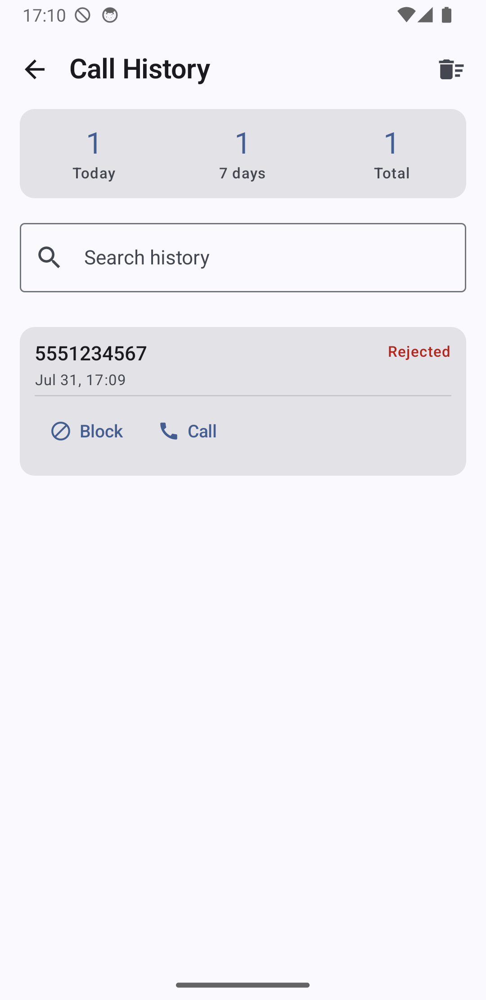
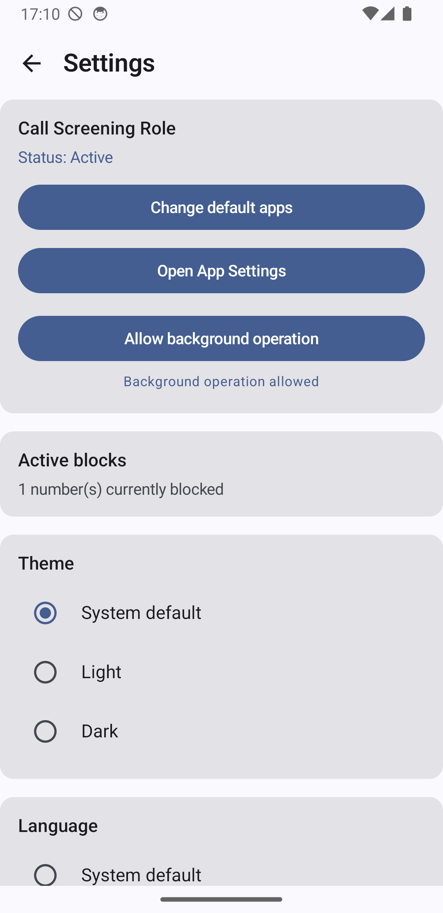

# CallTamer

Take control of unwanted calls on your phone.

CallTamer lets you block, silence, or reject calls from numbers you choose — without permanently blacklisting them. You decide how long a block lasts, and CallTamer remembers what happened so you can review it any time.

## What CallTamer can do

- **Block a number** — stop a specific number from reaching you.
- **Silence a call** — the phone rings silently, no sound, so you stay aware without the noise.
- **Reject a call** — the caller is rejected and the phone never rings.
- **Temporary or permanent blocks** — block for an hour, a day, until a custom date, or forever.
- **Call history** — see every call that was blocked, silenced, or allowed, with stats for today, the week, and all time.
- **Notifications** — get notified when a call is handled or when a temporary block expires, and control which notifications you receive.
- **Work in the background** — CallTamer keeps doing its job even when you aren't using the app.

## Getting started

1. Install CallTamer on your phone.
2. Open the app and complete the short setup.
3. Grant the call screening role when asked — this is what allows CallTamer to handle calls before they ring.
4. Add your first block and you're set.

## How blocking works

When someone calls a number you've blocked, CallTamer steps in automatically:

- **Reject** — the call is ended immediately and the phone never rings.
- **Silence** — the call rings silently, so you can see it without the sound.
- **Allowed** — numbers you haven't blocked ring normally, as always.

Every handled call is saved to your call history, where you can review or block a number again in one tap.

## Screenshots

<table>
  <tr>
    <td align="center"> Home</td>
    <td align="center"> Block details</td>
    <td align="center"> Call history</td>
    <td align="center"> Settings</td>
  </tr>
</table>

## Managing blocks

- **Add a block** — tap the + button, enter the number, choose how to handle the call and how long the block should last.
- **Review blocks** — your active blocks are shown on the home screen.
- **Change a block** — open a block to change its duration or behavior.
- **Unblock a number** — unblock any number at any time; you'll always be asked to confirm first, even from a notification.

## Settings

- **Call screening role** — view or change which app is set as the default caller ID and spam handler.
- **Notifications** — turn notifications on or off for rejected calls, silenced calls, and block expiries.
- **Background operation** — allow CallTamer to run in the background so it never misses a call.
- **Theme and language** — choose a light or dark theme and your preferred language.
- **Active blocks summary** — see at a glance how many numbers are currently blocked.

## Privacy

CallTamer works fully offline. All of your blocks and call history are stored on your device only — nothing is uploaded anywhere.

## Development

- **Java 25** or higher is required.
- **Gradle 9.6.1** or higher.
- **Android SDK 37** (API 37) is the target.

## Support

If you have questions or run into trouble, please open an issue in this repository.
